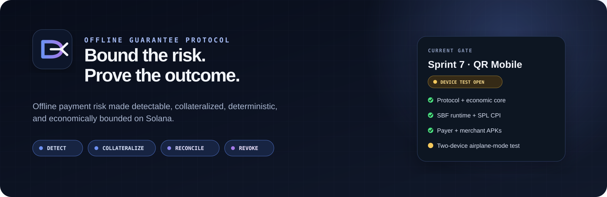
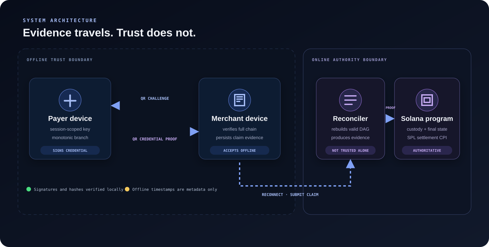
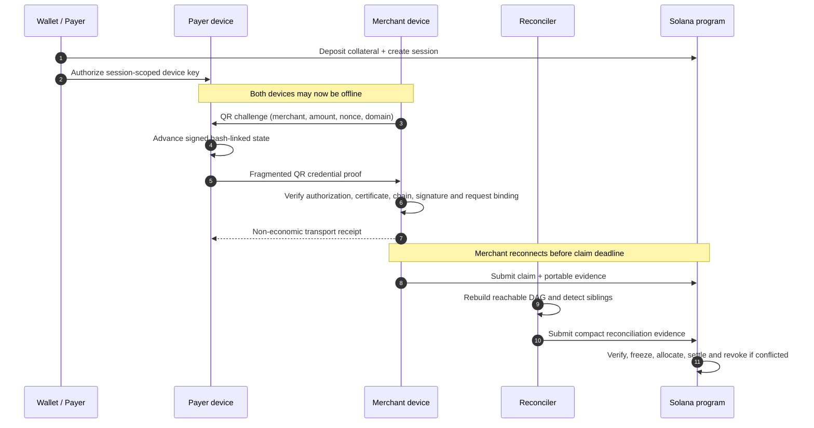
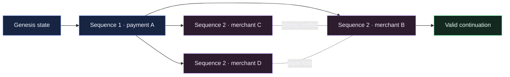
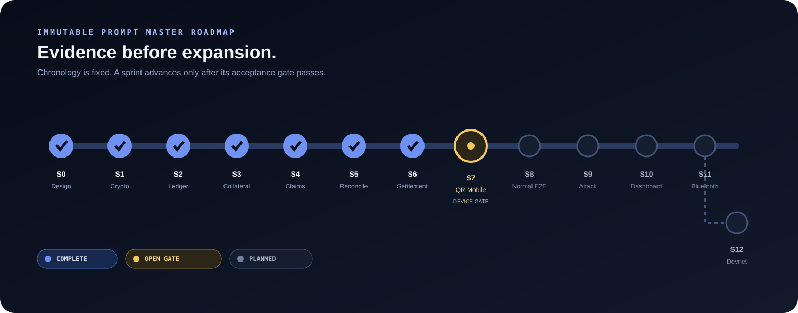

<p align="center">
  
</p>

<p align="center">
  <a href="#protocol-status"></a>
  <a href="docs/sprint-8-report.md"></a>
  <a href="https://github.com/caiomodesti/offline-guarantee-protocol/actions/workflows/sprint-3-runtime-acceptance.yml"></a>
  <a href="https://github.com/caiomodesti/offline-guarantee-protocol/actions/workflows/sprint-7-mobile-android.yml"></a>
</p>

<p align="center">
  <a href="docs/product-spec.md"></a>
  <a href="docs/protocol.md"></a>
  <a href="docs/architecture.md"></a>
  <a href="docs/threat-model.md"></a>
  <a href="docs/adr/README.md"></a>
  <a href="docs/requirements-traceability.md"></a>
</p>

<p align="center">
  <strong>Offline payments cannot eliminate double spending.</strong><br />
  OGP makes the risk detectable, collateralized, deterministic, and economically bounded on Solana.
</p>

> [!IMPORTANT]
> OGP is an experimental protocol and research-grade MVP. It is not production-ready, does not represent real BRL, does not integrate Pix, and does not claim that a compromised offline device cannot double spend.

---

## Navigate

<p align="center">
  <a href="#why-ogp">Why OGP</a> ·
  <a href="#how-it-works">How it works</a> ·
  <a href="#economic-model">Economic model</a> ·
  <a href="#forks-and-reconciliation">Forks</a> ·
  <a href="#mobile-qr-flow">Mobile QR</a> ·
  <a href="#protocol-status">Status</a> ·
  <a href="#immutable-roadmap">Roadmap</a> ·
  <a href="#run-the-repository">Run locally</a> ·
  <a href="#documentation-map">Docs</a>
</p>

## Why OGP

An online payment coordinator can reject a reused balance immediately. An offline merchant cannot ask the network whether the payer has already created another valid payment from the same state.

OGP starts from that limitation instead of hiding it:

- a payer locks collateral on Solana;
- the wallet authorizes a temporary, session-scoped device key;
- the device creates hash-linked payment credentials while disconnected;
- merchants verify portable evidence locally;
- claims are collected after reconnection;
- reconciliation reconstructs the valid state graph and detects forks;
- deterministic settlement distributes no more than the locked coverage cap;
- confirmed conflict revokes future offline access atomically.

The protocol does **not** make offline double spending impossible. It makes submitted, cryptographically valid conflicts provable and limits the protocol's economic responsibility.

## How it works

<p align="center">
  
</p>



### Trust boundaries

| Component | Trusted for | Not trusted for |
|---|---|---|
| Wallet authority | Authorizing the temporary device key | Ordering offline payments after disconnection |
| Payer device | Signing within its scoped session key | Preventing rollback when fully compromised |
| Merchant device | Local cryptographic verification and evidence retention | Knowing whether an unseen sibling branch exists |
| Reconciler | Reconstructing a candidate DAG and producing evidence | Unilateral settlement or changing authoritative state |
| Solana program | Custody, protocol state, proof checks, allocation and SPL settlement | Recovering claims that were never submitted |

## Economic model

“Offline limit” is intentionally split into three different quantities.

| Quantity | Meaning | Critical property |
|---|---|---|
| `branch_spending_limit` | Maximum cumulative spend along one valid branch | A single branch cannot advance beyond it |
| `aggregate_offline_exposure` | Sum of eligible exposure across all valid submitted branches | A fork can make this larger than the branch limit |
| `collateral_coverage_cap` | Maximum protocol liability reserved for the session | Derived on-chain from `collateral_locked`; never supplied by the device |

For the MVP:

```text
minimum collateral ratio = 300%
collateral_coverage_cap   = collateral_locked
protocol maximum payout  = min(eligible aggregate exposure, collateral_coverage_cap)
```

### Deterministic coverage

Claims are collected until `claim_submission_deadline`, then the eligible set is frozen. Arrival order does not affect economic priority.

- `FULLY_COVERED`: total eligible claims are less than or equal to the coverage cap;
- `INSOLVENT`: eligible claims exceed the cap and receive deterministic pro-rata allocation;
- duplicate economic state edges cannot receive twice;
- offline `created_at` values are metadata, never absolute ordering proof;
- withdrawal cannot reduce collateral below liability that may still appear during the claim window.

See [ADR-0003 — coverage policy](docs/adr/0003-coverage-policy.md) and [ADR-0009 — time window and withdrawal reserve](docs/adr/0009-time-window-and-withdrawal-reserve.md).

## Forks and reconciliation

A formal simple fork requires:

```text
same session
same parent_state_hash
same sequence
different resulting state_hash
valid authorization, certificate, transition and device signature on each edge
```

Two different payments with the same parent and sequence are siblings. Three valid siblings form a triple fork. Replaying the exact same credential is idempotent, not a fork. An invalid credential does not become economic exposure merely because its hashes look fork-shaped.



The MVP uses **off-chain reconstruction plus on-chain verification of compact evidence**. It avoids pretending that an off-chain service is trusted while keeping full graph reconstruction out of Solana's expensive execution path.

See [ADR-0001 — verifiable hybrid reconciliation](docs/adr/0001-verifiable-hybrid-reconciliation.md) and [ADR-0016 — deterministic reconciliation](docs/adr/0016-sprint-5-deterministic-reconciliation.md).

## Cryptographic domain separation

Signed and hashed objects bind enough context to prevent cross-environment replay:

- object type and protocol version;
- network and cluster genesis;
- Solana program ID;
- session public key;
- payer and merchant identities where applicable;
- sequence, parent state and resulting state;
- amount, merchant challenge and economic fields.

The same payload cannot silently move between localnet, devnet, mainnet, another program ID, another protocol version, or another session.

Encoding is canonical Borsh, hashes use SHA-256, and signatures use Ed25519. Published golden vectors are checked independently by TypeScript and Rust.

See [cryptography](docs/cryptography.md) and [ADR-0002 — canonical crypto domain](docs/adr/0002-canonical-crypto-domain.md).

## Mobile QR flow

Sprint 7 implements two Expo / React Native Android applications and a transport-independent protocol boundary:

```text
merchant amount
  → environment-bound CSPRNG challenge QR
  → payer scans without network
  → payer verifies request and signs the next state edge
  → payer displays fragmented, hash-bound proof QR
  → merchant reassembles and verifies the complete portable chain
  → merchant persists claim evidence before showing acceptance
  → merchant displays a non-economic receipt QR
  → payer verifies acknowledgement of the exact credential hash
```

The QR framing layer is deterministic and bounded:

- `OGPQR1` typed frames;
- complete-payload SHA-256;
- canonical unpadded base64url chunks;
- out-of-order and identical-duplicate safe;
- mixed, conflicting, missing, malformed, oversized and tampered transfers fail closed;
- maximum 64 KiB payload, 128 frames, default 480 raw bytes per frame.

The merchant UI displays verification only after shared production validation and evidence persistence:

```text
Session verified
Signature valid
Credential integrity
Guarantee present
Pending settlement
```

> [!WARNING]
> The Sprint 7 payer fixture contains development-only bootstrap material. It must be replaced by a freshly authorized on-chain session in Sprint 8 before devnet use.

### Android artifacts

Native development APKs for payer and merchant compiled successfully in [GitHub Actions run 31763513716](https://github.com/caiomodesti/offline-guarantee-protocol/actions/runs/31763513716), proving native compilation but not standalone operation: those artifacts require an Expo development server. Corrective [run 31768054067](https://github.com/caiomodesti/offline-guarantee-protocol/actions/runs/31768054067) proved standalone bundling. Physical-device [run 31842955479](https://github.com/caiomodesti/offline-guarantee-protocol/actions/runs/31842955479) produced compact `arm64-v8a` previews. Final payer correction [run 31848322396](https://github.com/caiomodesti/offline-guarantee-protocol/actions/runs/31848322396) restores the canonical 554-byte bootstrap fixture and verifies tests, v2 signature, manifest, ABI, embedded bundle, and SHA-256 digest.

Use the [two-device installation and offline test](docs/sprint-7-device-test.md). The core acceptance exchange passed with Wi-Fi and mobile data disabled. The restart/SecureStore matrix remains retained hardening evidence, but it no longer blocks Sprint 8 because the original Prompt Master defines Sprint 7 acceptance as offline communication working.

Full evidence: [Sprint 7 report](docs/sprint-7-report.md).

Sprint 8 is now in progress. Its first source-only increment adds strict `UserProfile`/`OfflineSession` account decoding and a fail-closed recovery gate that distinguishes the session PDA from the protocol `session_id`, honors profile revocation, rejects fixture provisioning, and blocks fresh exposure after local data loss while an old session remains active. No new APK was produced for this increment. See the [Sprint 8 report](docs/sprint-8-report.md) and [ADR-0019](docs/adr/0019-sprint-8-fail-closed-session-recovery.md).

## Demo evidence contract

Headline messages are protocol outputs, not dashboard-local theater.

| Message | Required evidence | Authoritative effect |
|---|---|---|
| `DOUBLE SPEND ATTEMPTED` | Valid provisional sibling evidence | Labeled detection; not yet final settlement |
| `FORK DETECTED` | Accepted on-chain fork evidence | Session becomes conflicted |
| `COLLATERAL COVERS CLAIMS` | Frozen eligible set and finalized allocation | Coverage state and payable amounts are authoritative |
| `OFFLINE ACCESS REVOKED` | Conflict finalization in the same atomic transition | Payer cannot open another offline session |

The frontend must learn these outcomes from program accounts, transaction confirmation, or emitted events. It may not invent them from local dashboard state.

See the complete [demo contract](docs/demo-script.md).

## Protocol status

| Layer | Evidence | Status |
|---|---|---|
| Architecture and deterministic MVP policy | Sprint 0 spec, ADRs and hostile audit | **PASS — frozen baseline** |
| Canonical cryptography | TypeScript + independent Rust vectors | **PASS** |
| Offline authenticated ledger | Property and adversarial tests | **PASS** |
| Collateral vault and sessions | SBF build, validator and real SPL CPI | **PASS** |
| Claim collection | Runtime-backed deadline and eligibility tests | **PASS** |
| Fork reconciliation | Validator-backed deterministic evidence | **PASS** |
| Allocation, settlement, revocation and withdrawal | Real SPL runtime execution | **PASS** |
| QR payer / merchant source and native APKs | Host suite, Metro bundles and Android CI | **PASS** |
| Two-device network-disabled camera flow | Owner-observed physical exchange | **PASS** |
| SecureStore and restart matrix | Physical device matrix | **OPEN NON-BLOCKING HARDENING** |
| Normal reconnect → claim → settlement E2E | Sprint 8 | **IN PROGRESS** |
| Devnet deployment | Sprint 12 | **NOT STARTED** |

Current decision:

```text
SPRINT 7 — PASS
CORE OFFLINE DEVICE FLOW ACCEPTED
SPRINT 8 — IN PROGRESS
```

### Verified baselines

```text
TypeScript / Vitest            71 tests passing across 11 files
QR adversarial tests            7 passing
Golden vectors                  6 passing
Rust canonical conformance      1 passing
Solana program Rust tests      16 passing
SBF + validator runtime        PASS
Real SPL Token CPI             PASS
Payer Android native build     PASS
Merchant Android native build  PASS
```

## Immutable roadmap

<p align="center">
  
</p>

| Sprint | Scope | State |
|---:|---|---|
| 0 | Decisions, economics, threat model, ADRs | Complete |
| 1 | Portable cryptographic core | Complete |
| 2 | Deterministic offline ledger | Complete |
| 3 / 3.5 | Collateral core and SBF/runtime proof | Complete |
| 4 | Claim verification and collection | Complete |
| 5 | Deterministic reconciliation | Complete |
| 6 | Allocation, SPL settlement, revocation and withdrawal | Complete |
| **7** | **Offline payer + merchant QR mobile flow** | **Complete** |
| **8** | **Normal E2E: deposit → session → offline pay → claim → settlement** | **In progress** |
| 9 | Controlled rollback and real adversarial fork demo | Planned |
| 10 | Normal and attack dashboard | Planned |
| 11 | Bluetooth transport, only after QR is functional | Planned |
| 12 | Devnet, deterministic reset, integration, docs and hardening | Planned |

The original Prompt Master controls chronology. New ideas do not silently reorder sprints; accepted changes require an explicit base-document decision.

## Repository map

```text
offline-guarantee-protocol/
├── apps/
│   ├── payer-mobile/           # offline payer QR flow
│   └── merchant-mobile/        # offline merchant verification flow
├── packages/
│   ├── canonical-codec/        # canonical Borsh + independent Rust harness
│   ├── credentials/            # authorization, certificate and credential objects
│   ├── crypto/                 # Ed25519, SHA-256 and domains
│   ├── offline-ledger/         # authenticated reachable DAG
│   ├── protocol-sdk/           # client-side protocol orchestration
│   ├── reconciliation/         # deterministic graph reconstruction
│   ├── shared-types/           # shared protocol model
│   └── transports/             # OfflineTransport + QRTransport
├── programs/offline-guarantee/ # Anchor / Solana program
├── tests/                      # unit, property, adversarial and runtime harnesses
├── fixtures/                   # pinned validator and integration evidence
├── scripts/                    # vector and reproducibility tools
└── docs/                       # specification, ADRs, audits and sprint reports
```

## Run the repository

### Requirements

| Tool | Pinned / accepted version |
|---|---|
| Node.js | `22.17.0` |
| pnpm | `11.16.0` through Corepack |
| Rust / Cargo | pinned by `rust-toolchain.toml` |
| Anchor | `1.0.2` |
| Solana runtime acceptance | pinned in the runtime report and workflow |

### Install and run the host suite

```powershell
corepack pnpm install --frozen-lockfile
corepack pnpm check
```

`check` performs TypeScript builds, mobile typechecks, Vitest, golden-vector verification, independent Rust conformance, and Solana program Rust tests.

### Focused commands

```powershell
corepack pnpm test:ts
corepack pnpm test:rust
corepack pnpm test:program
corepack pnpm typecheck:mobile
```

### Start the mobile development projects

```powershell
corepack pnpm --filter payer-mobile start
corepack pnpm --filter merchant-mobile start
```

Expo custom development builds are required because the apps use native secure storage, camera, and cryptographic polyfills. The current GitHub artifacts prove native compilation; they are not a production distribution.

### Runtime proof

The SBF/validator suite runs on pinned Linux CI because host-only Rust tests cannot prove PDA custody, CPI behavior, Solana Clock semantics, or atomic rollback. See [runtime acceptance](docs/sprint-3-runtime-acceptance.md) before reproducing it locally.

## Security model

The design assumes:

- Solana consensus and the deployed program behave correctly;
- classic SPL Token follows its documented semantics;
- wallet, identity and certificate authorities are distinct and not all compromised;
- cryptographic primitives remain secure;
- merchants retain and submit evidence before the claim deadline;
- fully compromised offline devices may roll back state and create forks.

### What the MVP guarantees

- signer and credential integrity under the stated key assumptions;
- deterministic detection of submitted valid sibling branches;
- replay-safe settlement for accepted economic state edges;
- protocol liability no greater than the session coverage cap;
- withdrawal cannot undercut outstanding possible liability;
- confirmed conflict prevents a new offline session.

### What it does not guarantee

- impossibility of double spending on a compromised offline device;
- full payment of every merchant when aggregate eligible exposure exceeds collateral;
- absolute offline event order from device timestamps;
- privacy from public Solana metadata;
- recovery of claims never submitted before the deadline;
- protection from compromised authorities, coerced keys or merchant collusion;
- production, legal, banking, Pix or real-currency finality.

### Privacy leakage acknowledged

Even without plaintext PII, on-chain and submitted evidence can correlate wallets, merchants, sessions, amounts, timing, claim hashes and settlement behavior. Privacy improvements are deferred, not ignored.

Read the [threat model](docs/threat-model.md), [risk model](docs/risk-model.md), [Sprint 0 hostile audit](docs/sprint-0-audit.md), and sprint-specific hostile audits before treating any property as guaranteed.

## Documentation map

### Product and protocol

| Document | Purpose |
|---|---|
| [Product specification](docs/product-spec.md) | Scope, actors, UX and acceptance criteria |
| [Protocol specification](docs/protocol.md) | State, claims, coverage and deterministic behavior |
| [Architecture](docs/architecture.md) | Trust boundaries, on/off-chain split and account model |
| [Cryptography](docs/cryptography.md) | Domains, encoding, hashes and signatures |
| [Demo contract](docs/demo-script.md) | Evidence behind every headline message |

### Security and decisions

| Document | Purpose |
|---|---|
| [Threat model](docs/threat-model.md) | Assets, adversaries, capabilities and mitigations |
| [Risk model](docs/risk-model.md) | Economic and protocol risks |
| [Decision register](docs/decision-register.md) | `DECIDED FOR MVP`, `DEFERRED`, and `OPEN RISK` |
| [Requirements traceability](docs/requirements-traceability.md) | Requirement → decision → trust → threat → mitigation → future test |
| [Architecture decision records](docs/adr/README.md) | Immutable rationale for major choices |

### Sprint evidence

| Sprint | Report |
|---:|---|
| 1 | [Cryptographic core](docs/sprint-1-report.md) |
| 2 | [Offline ledger](docs/sprint-2-report.md) |
| 3 | [Collateral core](docs/sprint-3-report.md) |
| 3.5 | [SBF and runtime acceptance](docs/sprint-3-runtime-acceptance.md) |
| 4 | [Claim verification](docs/sprint-4-report.md) |
| 5 | [Reconciliation](docs/sprint-5-report.md) |
| 6 | [Economic resolution](docs/sprint-6-report.md) |
| 7 | [QR mobile MVP](docs/sprint-7-report.md) |

## Program identity

```text
Program ID: 5Sa9K4yLThfeg9UN9sMsiQwNA2RKPbeDywgJvJ1rkgEm
Current target: reproducible local validator / private CI
Devnet deployment: Sprint 12 — not started
Settlement asset: classic mock SPL mint for tests
```

## Project invalidation conditions

The architecture would lose its reason to exist if evidence demonstrates that any of the following is unavoidable:

1. secure reconciliation requires a fully trusted central authority;
2. useful offline merchant verification cannot be performed from portable evidence;
3. compromised devices can create protocol-recognized liability above the coverage cap;
4. economically viable collateral ratios cannot support the intended use case;
5. Solana adds no useful custody, verification, settlement, or public-audit property over a central database;
6. deterministic settlement cannot remain independent of claim arrival order;
7. claim availability assumptions make the guarantee materially misleading.

These are explicit research falsifiers, not marketing caveats.

## Responsible use

Do not use this repository to represent insured deposits, real fiat balances, guaranteed merchant settlement, or production payment acceptance. Do not reuse development fixture keys outside local demonstration. Security findings should be reported privately to the repository owner before public disclosure.

---

<p align="center">
  <strong>Host tests prove logic. Runtime tests prove the protocol.</strong><br />
  <sub>Cobalt Ledger identity · canonical evidence · explicit limitations · immutable sprint gates</sub>
</p>
