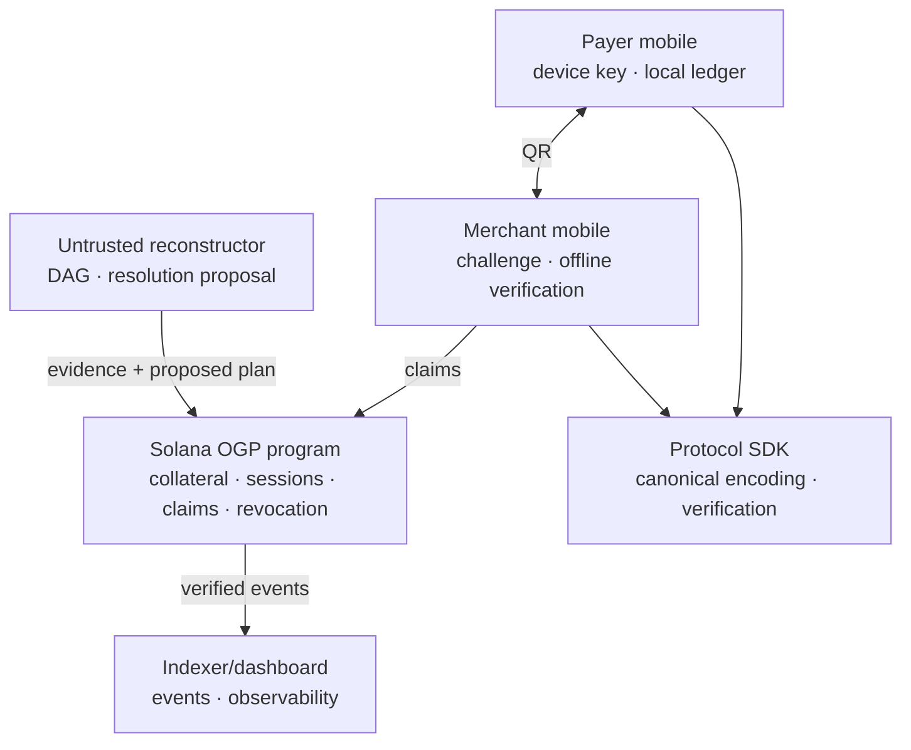

# Architecture

## Architectural principles

Solana is the neutral coordination and collateral layer. It owns economic facts; it does not store the complete offline history. Full credentials and graph reconstruction remain off-chain, while compact economic claims and adversarial evidence are verified at the program boundary.



## Source-of-truth boundaries

### On-chain

- protocol configuration, authority keys, domain identifiers, and pause state;
- opaque identity attestation reference and offline-access status;
- PDA-controlled SPL collateral custody;
- locked coverage, session parameters, status, deadlines, and device key;
- claim hashes, claimant merchant, amount, status, and settlement totals;
- accepted fork evidence commitments;
- resolution allocation, token settlement, and revocation;
- events required to reconstruct demo facts.

### Off-chain

- complete certificates and credentials;
- QR transport and local persistence;
- graph reconstruction and candidate resolution computation;
- adversarial simulation;
- indexing, analytics, labels, and visualization.

An off-chain component MAY propose results but MUST NOT make an economic fact true merely by writing a database row.

## Offline QR mobile boundary

Sprint 7 implements two Expo SDK 57 development-build apps and `@ogp/transports`. The merchant challenge is created without network access and before a payer session is known. It is bound to network, cluster genesis, program, merchant/device, amount, and a CSPRNG nonce. The payer response carries the exact session-domain `PaymentCredential` plus the complete portable authorization/certificate/ancestor chain.

The QR layer fragments payloads, hashes the complete transfer, and rejects missing, mixed, non-canonical, oversized, or tampered frames. It does not reinterpret canonical credential bytes. Merchant acceptance requires production verifier output and durable evidence storage; local UI state alone cannot produce `Guarantee present`. The optional return receipt is transport acknowledgement only.

Payer signing keys and merchant device keys use native secure storage. Public proof bundles and pending claims are locally persistent but not confidential. App restart must never reset the payer branch tip or silently reuse an outstanding challenge. See [ADR-0018](adr/0018-sprint-7-qr-mobile-flow.md).

Sprint 8 separates ordinary restart from loss of local authority. A complete matching local provisioning record and protected device key may resume offline use. Missing or inconsistent state fails closed: the app requires connectivity, reads `profile.active_session` and the session account from Solana, and requires a wallet signature. It never creates new exposure while an authoritative prior session remains active and never treats reinstall as cancellation of merchant claims. See [ADR-0019](adr/0019-sprint-8-fail-closed-session-recovery.md).

## Instruction placement for MVP

| Action | Placement and rationale |
|---|---|
| `initialize_protocol` | On-chain: fixes authorities, domain, mint, ratios, duration, deadline, and pause state |
| `register_identity_attestation` | On-chain opaque commitment/status; raw identity remains issuer-side |
| `create_user_profile` | On-chain because revocation gates future sessions |
| `create_vault` / `deposit_collateral` | On-chain SPL custody and accounting |
| `create_offline_session` | On-chain because it reserves collateral and fixes immutable bounds |
| `register_device_authorization` | Owner-only one-shot registration after runtime-derived session facts are finalized; makes the session portable/claim-ready |
| certificate production | Off-chain issuer signature over finalized on-chain `ACTIVE` session; issuer has no activation authority |
| credential creation/verification | Offline on payer/merchant devices using shared canonical SDK |
| `advance_session_phase` | Permissionless on-chain materialization of `ACTIVE -> CLAIM_WINDOW` using the Solana clock |
| `submit_claim_bundle` | Collect phase: on-chain critical verification and compact `SUBMITTED` claims; no payout; authenticated siblings confirm a fork |
| graph reconstruction | Off-chain because complete DAG traversal is data/compute heavy |
| provisional double-spend detection | Off-chain deterministic verifier over authenticated incompatible credentials; explanatory only, never economic authority |
| `confirm_authenticated_fork` | On-chain predicate verification, whether during claim collection or finalization; no privileged assertion is accepted |
| `finalize_session` / paginated finalization | After deadline: on-chain freeze, classification, completeness counters, coverage, allocations, and resolution hash |
| `settle_claim` | On-chain token transfer and idempotent accounting |
| `close_session` | On-chain only after liability is zero |
| `withdraw_collateral` | On-chain reserve formula and SPL transfer |

The earlier conceptual `reconcile_session` is split into begin/process/finalize instructions so transaction limits do not create a trusted off-chain shortcut. Exact instruction names may change in the implementation ADR, but the authority boundary may not.

## Reconciliation architecture comparison

| Property | A. Fully on-chain | B. Off-chain graph + on-chain verified evidence | C. Explicit reconciliation authority |
|---|---|---|---|
| Cost | Highest: credential bytes, graph traversal, and state growth consume transactions, compute, and rent | Medium: full graph stays off-chain; program verifies claims, signatures, hashes, fork witnesses, and allocations | Lowest program cost; authority signs a result |
| Security | Strongest independent verification if correctly implemented; still vulnerable to program bugs and data availability | Strong: relayer is untrusted, but verification completeness is security-critical | Depends on authority honesty and key security; unilateral censorship/misclassification risk |
| Complexity | Very high; transaction size, compute, pagination, and concurrency dominate | High but separable: deterministic SDK plus compact verification instructions | Low technical complexity, high governance and operational burden |
| Centralization | Lowest | Low for correctness; data availability and liveness services may still concentrate | Highest and explicit |
| Hackathon suitability | Poor | Best balance; attack proof can be real and affordable | Good demo speed, weakens core thesis |
| Production evolution | May require compression, batching, and redesigned accounts | Can add permissionless relayers, batched proofs, ZK/state proofs, or more verification over time | Can evolve to committee/multisig, but migration away from trust is difficult |

### MVP selection

Architecture **B** is **DECIDED FOR MVP**. An untrusted reconstructor builds the DAG. The program independently verifies claim identity, session/domain binding, merchant binding, duplicate keys, amounts, deadlines, signature-verification instructions, state-transition hashes, fork witness predicates, coverage arithmetic, and the final allocation. No reconciliation authority may invent or approve a claim.

The certificate issuer remains an explicit, narrower trust assumption: it attests a finalized session snapshot for offline portability but cannot settle, revoke, or withdraw. Replacing it with client-verifiable chain state proofs is **DEFERRED**.

See [ADR-0001](adr/0001-verifiable-hybrid-reconciliation.md).

## Proposed monorepo

Directories are created only when their sprint needs them.

```text
apps/{payer-mobile,merchant-mobile,dashboard,demo-controller}
programs/offline-guarantee
packages/{shared-types,canonical-codec,crypto,credentials,offline-ledger,reconciliation,protocol-sdk,transports,config}
services/{identity-attestation,indexer,settlement-simulator}
tests/{unit,integration,solana-program,reconciliation,adversarial,e2e}
docs/adr
```

`canonical-codec` is deliberately separate from `crypto`; canonical Borsh bytes are a protocol boundary, not a serialization convenience.

## Preliminary account model

This is a design contract, not implemented layout.

| Account | Seed concept | Owner/authority | Notes |
|---|---|---|---|
| ProtocolConfig | `["config"]` | program; admin and emergency authorities stored separately | Domain, issuer, parameters, pause |
| UserRiskProfile | `["user", owner]` | program; owner initiates registration | No PII |
| CollateralVault state | `["vault", owner, mint]` | program | Accounting and token-account address |
| SPL token vault | associated deterministic PDA scheme | vault PDA | Custody only |
| OfflineSession | `["session", owner, session_id]` | program | Fixed-size core state |
| Claim | `["claim", session, credential_hash]` | program | Exact replay/idempotency key plus verified hash-ordered pagination links |
| StateEdgeRecord | `["edge", session, parent_hash, sequence, child_hash]` | program | One economic inclusion/allocation per valid state edge; tracks smallest representative credential hash |
| ForkRecord | `["fork", session, parent_hash, sequence]` | program | One compact record per discovered divergence for MVP |

Claim PDAs stop exact replay; `StateEdgeRecord` stops economically equivalent wrappers with different credential hashes from being counted twice. Claim and edge accounts may be too costly at scale. Batched commitments or compressed state are **DEFERRED**. Ownership, signer, mint, token program, seeds, bump, session, and status constraints MUST be checked on every value-moving instruction.

## Authority model

| Authority | MVP decision |
|---|---|
| Wallet authority | Authorizes device/session and owns collateral rights |
| Device authority | Can sign credentials only for its exact session/domain |
| Certificate issuer | Signs portable session snapshots; cannot move value |
| Admin authority | Changes non-emergency configuration; separate from vault PDA |
| Emergency authority | Can pause new sessions/claims under documented rules; cannot seize collateral |
| Upgrade authority | Single development key on localnet/devnet is an **OPEN RISK**; multisig and transfer/revocation plan are required before production |

Emergency pause MUST stop new deposits, sessions, and claims. It MUST NOT erase claims, unlock reserved collateral, or prevent safe settlement/owner recovery under a future audited escape path.

## Settlement adapters

The domain interface is conceptually:

```text
SettlementAdapter
├── MockStablecoinAdapter     MVP
├── PixAdapter                DEFERRED
├── PSPAdapter                DEFERRED
└── OtherRails                DEFERRED
```

Only a mock SPL token adapter is in scope. A database cannot attest settlement.

## Privacy and metadata leakage

No CPF, name, address, document, photo, or raw KYC record is stored on-chain. Nevertheless, public state can correlate:

- wallet and vault ownership;
- merchant addresses and repeated relationships;
- session identifiers and device-key reuse mistakes;
- complete prior branch history disclosed inside a credential proof bundle to a later merchant;
- claim amounts and settlement amounts;
- `issued_at`, `expires_at`, submission slots, deadlines, and settlement timing;
- credential and certificate hashes across indexers;
- conflict history and revocation status.

This can reveal frequency, merchant networks, approximate activity windows, balances, and behavioral patterns. OGP v0.1 is explicitly not privacy-preserving. Rotating device keys per session is required, while commitments, selective disclosure, ZK proofs, rotating merchant identifiers, stealth addresses, confidential settlement, encrypted memos, private claims, and batching are **DEFERRED**. Privacy suitability is an **OPEN RISK**.

## Event catalog

Authoritative v0.1 events are `OfflineSessionCreated`, `ClaimSubmitted`, `AuthenticatedForkConfirmed`, `SessionMarkedConflicted`, `CoverageCalculated`, `CollateralCoverageApplied`, `ClaimSettled`, `OfflineAccessRevoked`, and `SessionClosed`. Custody operations may additionally emit `CollateralDeposited` and `CollateralWithdrawn`. Events mirror account transitions; they never replace account state. `DOUBLE SPEND ATTEMPTED` is explicitly provisional off-chain output and is never presented as a confirmed chain event. The indexer must tolerate replay and rebuild authoritative facts from confirmed transactions/accounts.

## Availability and indexing

Merchants retain full credentials until final settlement. Indexers are rebuildable from accounts and events. At least two independent copies of adversarial evidence SHOULD exist during the claim window. Loss of all full credential bytes can make a hash-only on-chain claim unauditable; durable decentralized evidence storage is **DEFERRED** and is an **OPEN RISK** for production.
