# Product specification

Status: **Sprint 0 normative specification**  
Protocol version: **1**  
Normative terms: **MUST**, **MUST NOT**, **SHOULD**, and **MAY** are requirements.

## Problem statement and thesis

An offline verifier cannot consult a global ledger and cannot prove that a compromised payer device has not restored an earlier state. OGP therefore does not claim prevention of offline double spending. It provides authenticated evidence, bounded protocol liability, deterministic reconciliation, collateral-backed resolution, and enforced future revocation.

The protocol thesis is: offline payments do not need to be risk-free; they need to be cryptographically verifiable, economically bounded, and safely reconcilable.

## Goals

1. A merchant can verify a portable session and merchant-bound payment credential without connectivity.
2. Each honest branch cannot exceed its configured branch spending limit.
3. Reconciliation accepts exact duplicates only once and identifies valid forks deterministically.
4. Solana is the economic source of truth for collateral, session status, settlement, and revocation.
5. Liability is capped, withdrawals preserve possible future claims, and insufficient coverage is resolved deterministically.
6. Every headline demo message is derived from verified protocol evidence and authoritative events.

## Non-goals

No real Pix, bank, PSP, KYC, stablecoin, token launch, DAO, AI, Bluetooth, NFC, hardware-backed keys, insurance pool, credit score, or multi-PSP deployment is part of the MVP. PostgreSQL and frontend state are never economic authorities.

## Participants and authorities

| Participant | Capability | Trust boundary |
|---|---|---|
| Payer wallet authority | Deposits collateral and authorizes a device/session | Must protect the wallet key |
| Payer device key | Signs offline state transitions for one session | May be compromised; authority is strictly scoped |
| Merchant | Creates a secure challenge, verifies, stores, and submits a claim | May lie or collude; cannot alter a signed credential |
| Protocol program | Custody, locks, statuses, idempotency, settlement, revocation | Authoritative economic state |
| Session certificate issuer | Attests that a portable certificate reflects a finalized on-chain session | Explicitly trusted in MVP; cannot move funds |
| Relayer/reconstructor | Reconstructs graphs and submits claims/evidence | Untrusted; outputs require on-chain verification |
| Mock identity issuer | Issues an opaque KYC attestation | Trusted only for KYC status, never custody |
| Indexer/dashboard | Reads events and explains state | Non-authoritative and rebuildable |

## Default economic scenario

All amounts are unsigned integers in mint minor units. The demo mint has two decimals.

| Parameter | Value |
|---|---:|
| deposited and locked collateral | `50000` (R$500.00 simulated) |
| branch spending limit | `15000` (R$150.00) |
| collateral coverage cap | `50000` (R$500.00) |
| minimum collateral ratio | `30000` basis points (300%) |
| demonstrated ratio | floor(`50000 * 10000 / 15000`) = `33333` bps (333.33%) |
| session duration | 3 hours |
| claim submission grace period | 6 hours after `expires_at` |
| simultaneous open sessions per payer | 1 |
| maximum credential depth per branch | 32 |

No displayed fiat symbol asserts redemption or legal denomination. “R$” is demo presentation for the mock two-decimal asset.

## The three distinct limits

### `branch_spending_limit`

A session configuration value. For every path from genesis to a credential, the sum of amounts on that path MUST be at most `branch_spending_limit`. Honest state transitions decrement `remaining` from this value. It protects an individual branch but cannot bound the sum across hidden forks.

Official linear example in minor units: `4000 + 6000 + 5000 = 15000` is valid; another `2000` transition is rejected. Under compromise, branches A, B, and C may each remain at or below `15000` while their unique aggregate exceeds it.

### `aggregate_offline_exposure`

A reconciliation metric, not a payer-controlled limit:

```text
aggregate_offline_exposure = sum(amount(c))
  for every unique eligible credential c in the reachable session DAG
```

Common-prefix credentials are counted once, exact replays are counted once, distinct wrappers of the same economic state edge are counted once, and distinct valid fork edges are counted separately. It can exceed `branch_spending_limit` and `collateral_coverage_cap`.

Example: two valid fork branches of `12000` and `10000` from the same parent create `aggregate_offline_exposure = 22000`, although neither branch exceeds `15000`.

### `collateral_coverage_cap`

The maximum token amount the protocol commits to the session across all settlements:

```text
0 < collateral_coverage_cap = collateral_locked
```

For MVP, `collateral_coverage_cap = collateral_locked = 50000`. Total settlement for the session MUST NOT exceed this cap. The cap bounds protocol liability, not the nominal amount a compromised key can promise.

## Lifecycle

```mermaid
stateDiagram-v2
    [*] --> ACTIVE: session created on-chain
    ACTIVE --> CLAIM_WINDOW: expires_at
    ACTIVE --> CONFLICTED: authenticated fork confirmed
    CLAIM_WINDOW --> CONFLICTED: authenticated fork confirmed
    CLAIM_WINDOW --> RECONCILING: deadline reached; finalize
    CONFLICTED --> RECONCILING: deadline reached; finalize
    RECONCILING --> SETTLED: fully covered, no fork
    RECONCILING --> CONFLICTED: fully covered authenticated fork
    RECONCILING --> INSOLVENT: eligible total exceeds cap
    SETTLED --> CLOSED: settlement complete
    CONFLICTED --> CLOSED: covered settlement complete
    INSOLVENT --> CLOSED: pro-rata settlement complete
    CLOSED --> [*]
```



`offline_access_enabled` belongs to the user profile, not the session enum. On-chain confirmation of an authenticated fork MUST atomically set the session to `CONFLICTED`, set `authenticated_fork = true`, set `offline_access_enabled = false`, set `revoked_at`, and emit the authoritative conflict and revocation events. The session remains claimable until its deadline and payable after revocation. A sticky fork flag preserves the incident when the lifecycle temporarily enters `RECONCILING`.

Solana accounts do not change merely because wall-clock time passes. `CLAIM_WINDOW` is materialized by a permissionless phase-advance instruction or as the first step of any post-expiry instruction using the on-chain clock.

## Time semantics

- `issued_at` and `expires_at` are authoritative session parameters recorded on-chain.
- A compliant device MUST NOT create a credential after `expires_at` according to its available clock.
- A merchant MUST reject a credential when its available clock indicates expiry.
- `created_at` is signed metadata. It is not absolute proof of creation time or order.
- Reconciliation MUST NOT select a branch because it has an earlier `created_at`.
- A compromised payer can backdate. This is an **OPEN RISK** without trusted hardware or an online time authority.
- `claim_submission_deadline = expires_at + 6 hours` for MVP. Official example: creation 12:00, expiry 15:00, claim deadline 21:00. A new claim submitted after this deadline is rejected, although an already-submitted claim may finish reconciliation and settlement afterward.

## Success criteria for later sprints

- byte mutation invalidates an affected signature or hash;
- serialization is cross-language deterministic;
- normal, simple-fork, and triple-fork graphs produce specified results;
- replay, merchant mismatch, expiry, invalid certificate, and unsafe withdrawal fail with stable errors;
- conflict revocation prevents session creation on-chain;
- authoritative demo messages are reconstructible from chain accounts/events after deleting dashboard state; the provisional double-spend warning is recomputable from retained canonical credentials and clearly labeled non-authoritative.

## What would invalidate the project?

The architecture loses its rationale if any of these conditions is demonstrated:

1. An offline merchant cannot verify economically useful information beyond the payer app's assertion.
2. A compromised device can create economically payable protocol liability without a collateral-related cap, or withdraw reserved backing.
3. A central server/reconciler must have unilateral, unverifiable final authority over claims, conflicts, or funds, making Solana non-substantive.
4. Required collateral ratios make normal use economically irrational compared with prefunding or existing rails.
5. The real demo cannot produce valid signed fork evidence, program confirmation, collateral settlement, and enforced revocation.
6. Ordinary claim volume makes verifiable evidence or settlement technically unaffordable.
7. Certificate freshness, hidden-fork uncertainty, or privacy leakage makes the stated guarantee materially misleading or unacceptable.
