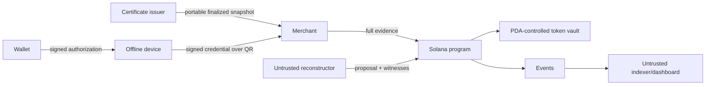

# Threat model

## Assets

- SPL collateral and settlement allocations;
- wallet, device, merchant, issuer, admin, emergency, and upgrade keys;
- session/certificate integrity;
- claim completeness and idempotency;
- revocation correctness;
- merchant evidence availability;
- privacy of transaction relationships.

## Adversaries

- compromised or malicious payer device;
- malicious payer wallet owner;
- malicious merchant, merchant coalition, or self-merchant;
- untrusted relayer/reconstructor/indexer/frontend;
- compromised certificate or identity issuer;
- program admin/upgrade-key attacker;
- network censor or availability attacker.

## Trust boundaries

Only the program and SPL token account establish economic truth. Issuers establish limited attestations. UI, relayers, and databases are untrusted.

## Official MVP trust assumptions

1. Solana and the SPL token program execute correctly.
2. The payer's main wallet private key is not compromised.
3. The mock identity issuer honestly issues its limited attestations.
4. An intact device follows the state machine; the adversarial model allows rollback/full device compromise.
5. Ed25519 and SHA-256 retain their expected security properties.
6. Merchants protect their own keys and use a system CSPRNG.
7. The reconciler is not sovereign economic authority; critical evidence and every value-moving transition are program-verifiable.
8. Full payer-merchant collusion is not solved in v0.1.

## Required threat cases

| Attack | Detection/mitigation | Required result | Residual risk |
|---|---|---|---|
| Credential amount tampering | signature and recomputed state hash | `INVALID_SIGNATURE` or `INVALID_TRANSITION` | Endpoint may display tampered data before verification if UI is buggy |
| Exact replay | claim PDA keyed by credential hash | `DUPLICATE_CREDENTIAL`; no second allocation | DoS fees for submitter |
| Distinct wrapper for identical state edge | state-edge uniqueness key plus deterministic representative hash | `DUPLICATE_STATE_EDGE`; one amount/allocation | Extra account/compute load and metadata grinding |
| Merchant mismatch | signed merchant fixes the claim settlement destination, regardless of relayer | `MERCHANT_MISMATCH` | Compromised merchant key |
| Trivial self-merchant | require payer wallet != merchant wallet | `SELF_MERCHANT_FORBIDDEN` | Same controller can use two wallets |
| Expired session | merchant local check, signed range, on-chain deadline | `SESSION_EXPIRED` locally or metadata/deadline rejection | Backdating and inaccurate offline clocks |
| Fake certificate | configured issuer signature plus on-chain immutable match | `INVALID_SESSION_CERTIFICATE` | Compromised issuer can mis-attest portable freshness, but cannot move funds |
| Local rollback | two valid reachable sibling edges | `CONFLICT_DETECTED` and revocation | Hidden branch remains unknown until submitted |
| Double/triple spend | formal child-set cardinality | `CONFLICT_DETECTED`; all eligible edges enter coverage | Aggregate face value may exceed cap |
| Unauthorized withdrawal | reserve formula, PDA custody, owner/mint/status constraints | `UNSAFE_WITHDRAWAL` | Program/accounting bug |
| Revoked payer creates session | profile flag checked on-chain | `OFFLINE_ACCESS_REVOKED` | Merchant offline cannot learn revocation of an already issued certificate |
| Re-submit settled claim | claim status and cumulative cap | `ALREADY_SETTLED` | Account substitution bug if constraints fail |
| Domain replay | complete domain header | `DOMAIN_MISMATCH` | Misconfigured client trusts wrong domain |
| Malicious reconstructor omission | on-chain claim count/sum and paginated inclusion | finalization cannot complete | Liveness censorship; anyone must be able to continue |
| Invalid branch used to revoke | verify signatures, transition, and reachability | no fork record/revocation | Verification parser bug |
| Fabricated independent parent | complete genesis-to-tip proof bundle | `INVALID_PARENT`; no eligible claim | Proof size and prior-payment privacy leakage |
| Collateral arithmetic overflow | checked `u64` state and `u128` intermediates | transaction fails | Implementation mistakes require fuzzing/formal review |
| Fake demo alert | provisional result must contain production-verifier predicate output; authoritative UI requires chain events/accounts | no economic state from provisional alert | Compromised frontend can still lie to its own viewer |

## Invariants

1. Actual vault token balance and every stored monetary amount are non-negative unsigned values.
2. `sum(session settlements) <= collateral_coverage_cap = collateral_locked` for MVP v0.1.
3. `sum(vault reservations) <= actual vault token balance` before any withdrawal succeeds.
4. A revoked user cannot create a session.
5. A non-terminal session reserves its unpaid coverage cap until final resolution.
6. Neither an identical credential nor a distinct wrapper for the same state edge can create or settle two economic claims.
7. Valid reachable same-parent/same-sequence/different-child edges imply a fork.
8. Invalid or unreachable edges cannot imply a fork.
9. Credential mutation invalidates its signature/hash relationship.
10. A merchant cannot redeem a credential bound to another merchant.
11. Allocation is a pure function of the frozen eligible set and cap, independent of arrival order.
12. Revocation and conflict recording are atomic.
13. Pause cannot erase liability or unlock reserves.
14. No claim settles during collection or before post-deadline finalization.
15. At most one `ACTIVE`, `CLAIM_WINDOW`, `RECONCILING`, `CONFLICTED`, or `INSOLVENT` session exists per payer.

## Abuse analysis

### Compromised certificate issuer

The issuer can sign a portable certificate inconsistent with chain state and fool an offline merchant until reconciliation. The program then rejects the claim because immutable on-chain parameters do not match, leaving the merchant unpaid. This explicit trust is an **OPEN RISK**. Issuer bonds, multiple attestations, or chain-state proofs are **DEFERRED**.

The issuer can delay or withhold the portable certificate, but it has no activation authority and cannot alter or move the session collateral. Issuer availability remains an **OPEN RISK**.

### Merchant collusion and self-merchant

A payer can collaborate with merchants to manufacture signed claims and consume its own collateral, potentially laundering or disputing identity. The MVP rejects only `payer_wallet == merchant_wallet`; two controlled wallets bypass that check. Since the payer's device signature authorizes the payment and total liability is capped by its collateral, the MVP otherwise treats these claims like eligible claims. Merchant identity, registration, reputation, related-party detection, velocity rules, secure hardware, and fraud monitoring are **DEFERRED**.

OGP v0.1 protects merchants against bounded conflicting payer histories; it does not provide complete fraud resistance against payer-merchant collusion.

### Claim spam and account growth

A compromised device can create many valid fork credentials. Claimants pay submission/account costs, but validation and finalization may become a liveness attack. Per-session scalable commitments, fee policy, and bounded batch design require measurement. This is an **OPEN RISK** and may invalidate the approach if verification cost is not practical.

### Offline revocation blindness

After a session certificate is issued, an offline merchant cannot observe later revocation. Short sessions, cap reservation, and expiry bound but do not eliminate this exposure. Production-grade revocation distribution is **DEFERRED**.

### Proof-chain privacy and size

To prove reachability without trusting the payer after reconnection, the merchant receives the complete branch prefix, capped at 32 credentials. This exposes prior merchant/amount metadata and grows QR payloads linearly. Succinct accumulators or proofs are **DEFERRED**; suitability of the MVP disclosure is an **OPEN RISK**.

## Security controls required before any deployment

- checks-effects-interactions for token CPIs;
- explicit account owner, signer, seed, bump, mint, token-program, and session constraints;
- PDA-controlled custody with separate admin/emergency/upgrade authorities;
- checked arithmetic and conservative failure behavior;
- emergency pause that preserves settlement and reserves;
- LiteSVM/Mollusk unit tests, property/fuzz tests, integration tests, static analysis, and independent review;
- multisig and upgrade plan before valuable deployment;
- no hardcoded private keys, secrets, demo validation bypasses, or frontend-trusted flags.

## Open risks accepted for MVP

Software key compromise, offline time backdating, issuer mis-attestation, hidden forks, merchant collusion, public metadata, evidence loss, spam/liveness, and devnet upgrade-key centralization remain explicit. The MVP is experimental and must not hold real customer funds.
